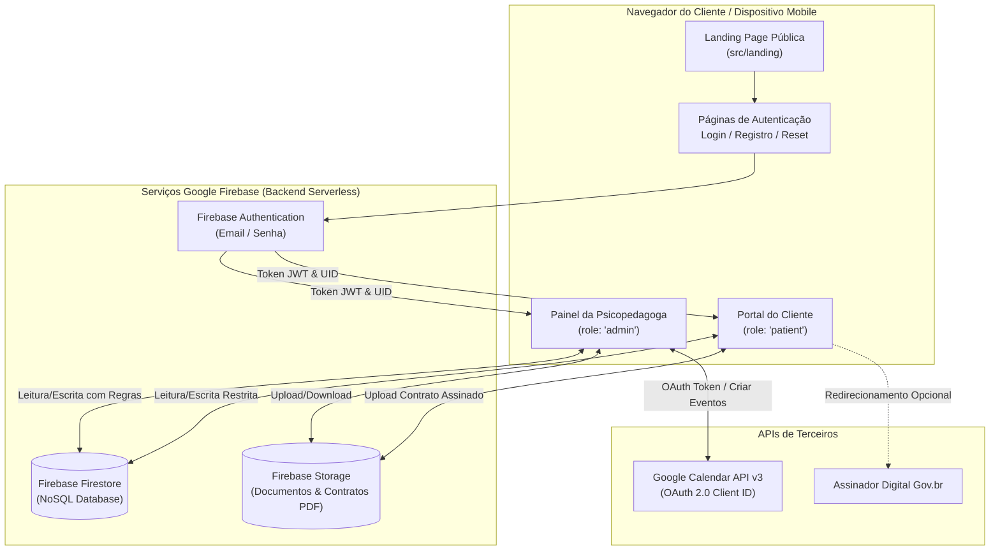
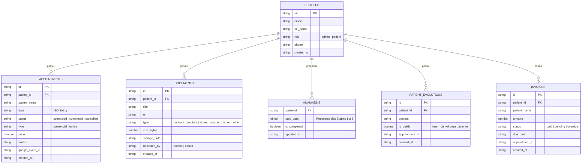
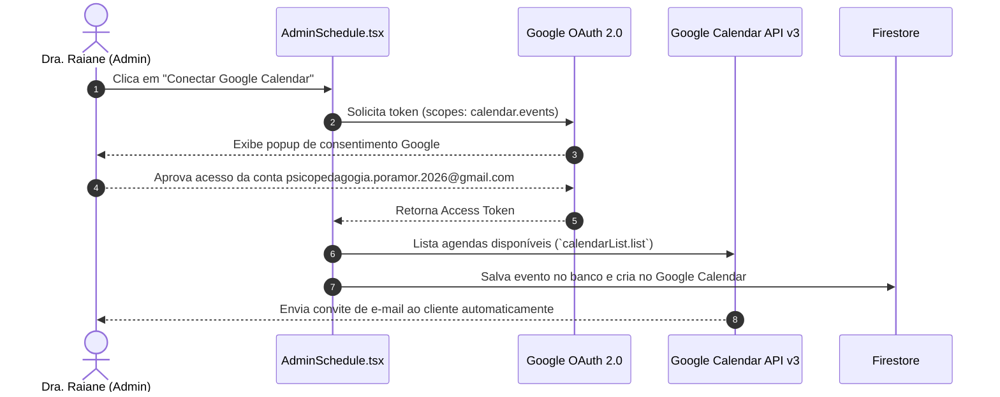
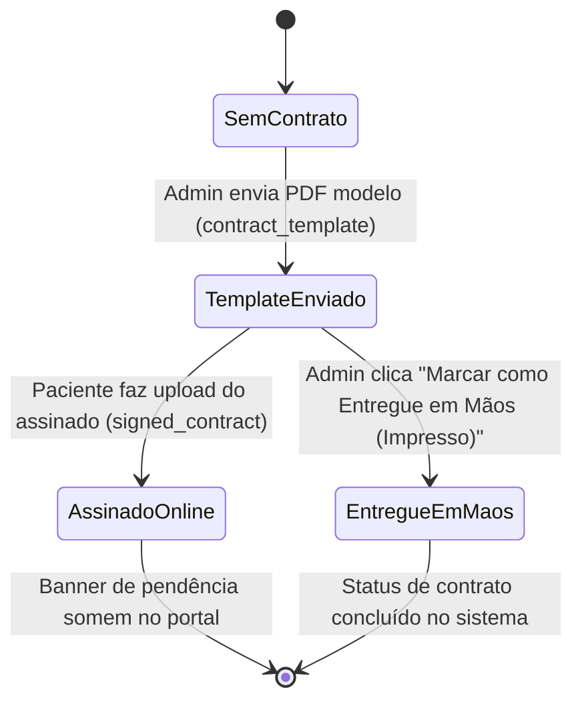
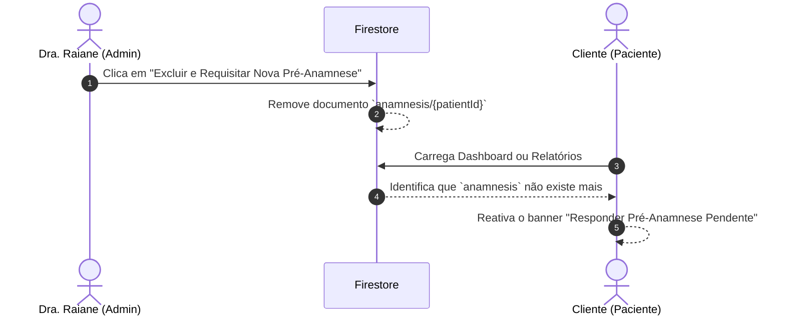

# 🏗️ ARCHITECTURE.md — Documentação Arquitetural do Sistema

> **Visão técnica detalhada da arquitetura, modelagem de dados, regras de segurança e integrações externas da plataforma Psicopedagogia por Amor.**

---

## 📌 1. Visão Geral da Arquitetura

O sistema é construído como uma **Single Page Application (SPA)** moderna utilizando React, TypeScript e Vite, integrada ao ecossistema Serverless do **Google Firebase** (Auth, Firestore, Storage) e à API do **Google Calendar**.

### Diagrama de Arquitetura de Alto Nível (Mermaid)



---

## 🗄️ 2. Modelagem do Banco de Dados (Firestore NoSQL)

As coleções no Firestore foram estruturadas para garantir desempenho rápido, consultas diretas por `patient_id` e controle de permissão por usuário.

### Schema das Coleções



---

## 🛡️ 3. Regras de Segurança (Security Rules)

### Firestore Security Rules (`firestore.rules`)
Garantem que apenas o administrador pode acessar todos os dados, enquanto os pacientes só conseguem ler/escrever registros estritamente vinculados ao seu próprio `UID` (`request.auth.uid`).

```rules
rules_version = '2';
service cloud.firestore {
  match /databases/{database}/documents {
    function isAdmin() {
      return request.auth != null &&
        get(/databases/$(database)/documents/profiles/$(request.auth.uid)).data.role == 'admin';
    }

    match /profiles/{userId} {
      allow read, write: if request.auth != null && (request.auth.uid == userId || isAdmin());
    }

    match /anamnesis/{patientId} {
      allow read, write: if request.auth != null && (request.auth.uid == patientId || isAdmin());
    }

    match /{collectionName}/{docId} {
      allow read, write: if request.auth != null && (
        isAdmin() ||
        (request.resource != null && request.resource.data.patient_id == request.auth.uid) ||
        (resource != null && resource.data.patient_id == request.auth.uid)
      );
    }
  }
}
```

### Storage Security Rules (`storage.rules`)
Controlam o armazenamento de fotos e PDFs em `patient-documents/{patientId}/*`.

```rules
rules_version = '2';
service firebase.storage {
  match /b/{bucket}/o {
    match /patient-documents/{patientId}/{allPaths=**} {
      allow read, write: if request.auth != null;
    }
    match /{allPaths=**} {
      allow read, write: if request.auth != null;
    }
  }
}
```

---

## 🔄 4. Fluxos de Trabalho Críticos do Sistema

### A. Fluxo de Integração com o Google Calendar API (`src/platform/lib/googleCalendar.ts`)



### B. Fluxo do Ciclo de Vida de Contratos



### C. Fluxo de Reset e Solicitação de Nova Pré-Anamnese



---

## 🎨 5. Design System & Temas (Light / Dark Mode)

O projeto adota a especificação do **Material Design 3 (M3)** utilizando classes semânticas do TailwindCSS v4 com suporte total a **Modo Claro** e **Modo Escuro**:

- **`bg-background`**: Fundo geral da página.
- **`bg-surface`**: Fundo dos cartões e contêineres principais.
- **`bg-surface-variant`**: Fundo dos chips, selos e elementos secundários.
- **`text-on-surface`**: Cor primária de texto.
- **`text-on-surface-variant`**: Cor de texto secundária (rótulos e subtítulos).
- **`text-primary` / `bg-primary`**: Tom roxo psicopedagógico oficial da marca.
